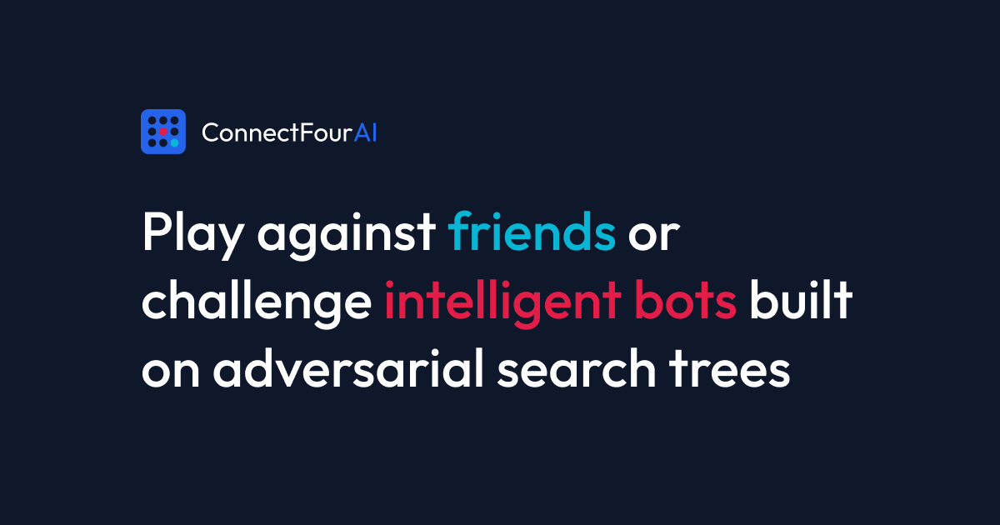

# ConnectFourAI


<p align="center">
  <a href="https://agrolax.github.io/ConnectFourAI/">
    
  </a>
  <a href="https://drive.google.com/file/d/1y2wWAQm4yup-qS83wxJwfMiI9vDKFCA4/view?usp=sharing">
    
  </a>
  <a href="./assets/report.pdf">
    
  </a>
  <a href="./evaluation_results.md">
    
  </a>
  <a href="./evaluation_results.json">
    
  </a>
</p>

Connect Four is played on a 7 × 6 board (7 columns, 6 rows). Two players alternately drop a disc into one of the seven columns; a disc falls to the lowest empty cell of that column. The first player to connect four consecutive discs horizontally, vertically, or diagonally wins. If the board fills with no winner, the game is a draw.

This repository contains a modular Python implementation of a Connect Four game engine and a suite of seedable AI agents, alongside a responsive full-stack Web GUI sandbox for live agent evaluations.

---

## 🚀 Quick Start

### 1. Run Automated Unit Tests
To verify core engine correctness, win/draw state transitions, and agent decision logic:
```bash
python3 -m unittest discover -s tests
```

### 2. Play Game (Interactive CLI)
Run the main script to play against the AI agents or local players:
* **Player vs Player (Local):**
  ```bash
  python3 main.py --mode player-vs-player
  ```
* **Player vs Random AI:**
  ```bash
  python3 main.py --mode player-vs-random
  ```
* **Player vs Rule-Based AI:**
  ```bash
  python3 main.py --mode player-vs-rulebased
  ```
* **Player vs Minimax AI:**
  ```bash
  python3 main.py --mode player-vs-minimax
  ```

### 3. Simulate Game (AI vs AI)
To simulate games between agents with a deterministic seed for evaluation:
```bash
python3 main.py --mode minimax-vs-random --seed 42 --delay 0.5
```

---

## 📂 Project Navigation & Deliverables

| Deliverable / Asset | Location / Link | Description |
| :--- | :--- | :--- |
| **Live Hosted Sandbox** | [GitHub Pages Deployment](https://agrolax.github.io/ConnectFourAI/) | Interactive full-stack web GUI for real-time play and evaluation |
| **Demonstration Video** | [Google Drive Walkthrough](https://drive.google.com/file/d/1y2wWAQm4yup-qS83wxJwfMiI9vDKFCA4/view?usp=sharing) | Walkthrough demonstrating CLI runs, unit tests, and agent gameplay |
| **Project Report** | [assets/report.pdf](./assets/report.pdf) | Algorithm designs, evaluations, and analysis |
| **Evaluation Data** | [evaluation_results.md](./evaluation_results.md) · [evaluation_results.json](./evaluation_results.json) | Compiled pairing metrics, win rates, and step logs |
| **Test Suite** | [tests/test_engine.py](./tests/test_engine.py) · [tests/test_agents.py](./tests/test_agents.py) | Unit tests verifying core game rules and agent behaviors |

### Core Source Code Map
* **Game State Engine:** [ConnectFourAI/engine.py](./ConnectFourAI/engine.py) — 2D board state, gravity-drops, horizontal/vertical/diagonal win scanners, deep clone state.
* **Abstract Base Agent:** [ConnectFourAI/agents/base.py](./ConnectFourAI/agents/base.py) — Define contract for agents.
* **Random Agent (Agent 1):** [ConnectFourAI/agents/random_agent.py](./ConnectFourAI/agents/random_agent.py) — Seedable stochastic action selection.
* **Rule-Based Agent (Agent 2):** [ConnectFourAI/agents/rule_based_agent.py](./ConnectFourAI/agents/rule_based_agent.py) — Heuristic priority rules (Win, Block, Center preference, Line builder).
* **Minimax Agent (Agent 3):** [ConnectFourAI/agents/minimax_agent.py](./ConnectFourAI/agents/minimax_agent.py) — Depth-limited adversarial search with $\alpha$-$\beta$ pruning and heuristic evaluation.

---

## 🛠️ Technical Requirements 

### Requirement 1: Game Engine
* **Implementation File:** [ConnectFourAI/engine.py](./ConnectFourAI/engine.py)
* **Details:**
  * **Board Representation:** 6 rows × 7 columns grid (0 = empty, 1 = Player 1, 2 = Player 2).
  * **Gravity Simulation:** Disc placement slides to the lowest empty index of the column.
  * **API Features:** Out-of-bounds validation, legal moves generator, deep cloning for forecasting, and win scanners in all 4 planes.

### Requirement 2: AI Agents
* **Implementation Files:**
  * [ConnectFourAI/agents/random_agent.py](./ConnectFourAI/agents/random_agent.py) (Agent 1 - Stochastic selection)
  * [ConnectFourAI/agents/rule_based_agent.py](./ConnectFourAI/agents/rule_based_agent.py) (Agent 2 - Heuristic priority matching)
  * [ConnectFourAI/agents/minimax_agent.py](./ConnectFourAI/agents/minimax_agent.py) (Agent 3 - Adversarial tree search)

### Requirement 3: Experimental Evaluation
* **Runner Script:** [evaluate.py](./evaluate.py) (logs decision times using `time.perf_counter()`)
* **Evaluation Data:** [evaluation_results.md](./evaluation_results.md) · [evaluation_results.json](./evaluation_results.json)
* **Protocol:** 30 games per pairing, alternating starting player, seeded agents for reproducible actions.

#### Case Study A - Random vs Rule-Based
| Agent | Wins | Win Rate | Draws | Avg Decision Time |
|---|---:|---:|---:|---:|
| Random | 1/30 | 3.33% | 0 | 0.0012 ms |
| Rule-Based | 29/30 | 96.67% | 0 | 0.2555 ms |

#### Case Study B - Rule-Based vs Minimax
| Agent | Wins | Win Rate | Draws | Avg Decision Time |
|---|---:|---:|---:|---:|
| Rule-Based | 3/30 | 10.00% | 1 | 0.2719 ms |
| Minimax (depth 4) | 26/30 | 86.67% | 1 | 33.4204 ms |

#### Case Study C - Minimax vs Random
| Agent | Wins | Win Rate | Draws | Avg Decision Time |
|---|---:|---:|---:|---:|
| Minimax (depth 4) | 30/30 | 100.00% | 0 | 42.5260 ms |
| Random | 0/30 | 0.00% | 0 | 0.0021 ms |

### Requirement 4: Report
* **Artifact:** [assets/report.pdf](./assets/report.pdf) (Backup: [CP468 Assignment 2 Report.pdf](./CP468%20Assignment%202%20Report.pdf))

### Requirement 5: Demonstration Video
* **Walkthrough Link:** [Watch the Walkthrough Video](https://drive.google.com/file/d/1y2wWAQm4yup-qS83wxJwfMiI9vDKFCA4/view?usp=sharing)

---

## 🔬 Deterministic Seeding & Test Environment Control

Computers rely on Pseudo-Random Number Generators (PRNGs) which are mathematical algorithms (e.g., Python's Mersenne Twister or JavaScript's Linear Congruential Generator) that compute sequences of numbers starting from an initial integer called a **seed**. Because these algorithms are fully deterministic, using the same seed ensures the exact same sequence of choices is generated every time. 
